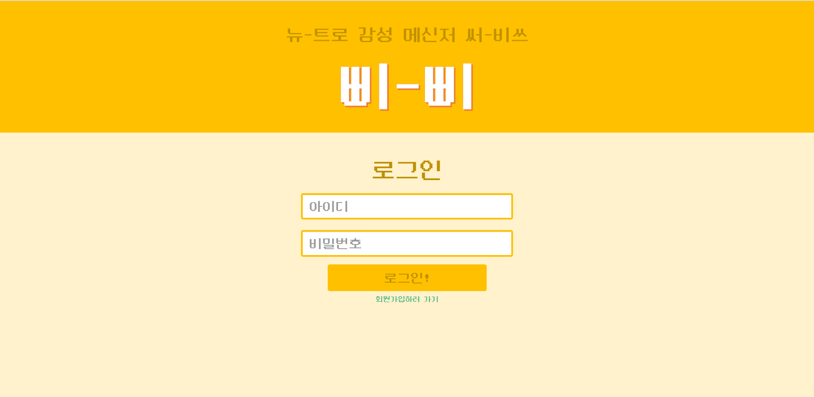
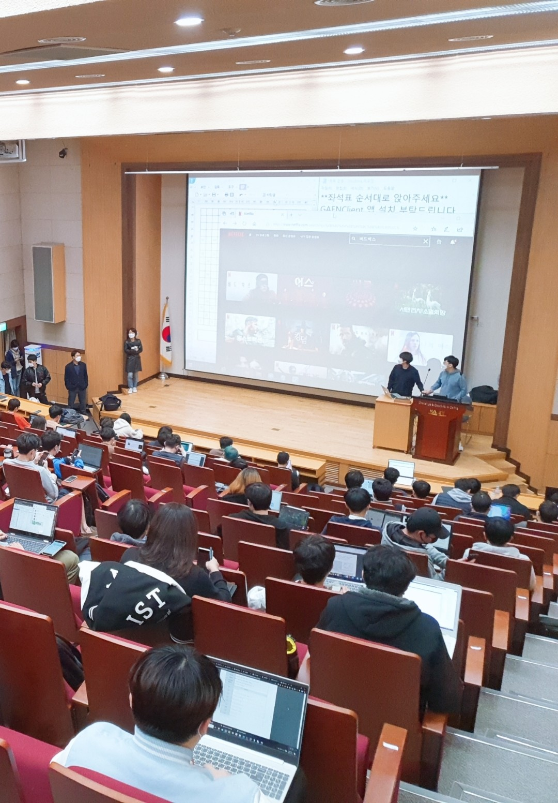

# Woomin Song (송우민, totolacky)

## About Me

KAIST Undergraduate in 4th year

**Major**: Electrical Engineering, **Double Major**: Computer Science, **Minor**: Mathematical Science

Languages: C, Python, Java, Kotlin, Javascript

Interests: A wide variaty of fields including (but not limited to)
* Machine learning
* App/web development
* Game development

## Recent Projects

### [OwnModel: An AI Fitting Photo Synthesis Service](https://github.com/HyeongshinYoon/OpenSource_2020) (2020)

* Technology Stack: Pytorch, Tensorflow, Vue.js, Flask, Firebase, OpenCV
* Team size: 3
* Awards
  - 1st prize at KAIST Open Source SW Invention Contest (2020 카이스트 오픈소스 SW발명품 공모전 1등상)
  - Qualified for the start-up competition U300 in 2020 (2020 학생 창업유망팀 300 경진대회 U300 본선 진출)
* Main Contribution
  - Involved in the overall service design process
  - Modifying open source StyleGAN code, and including it in the service pipeline
  - Frontend development

### [BBIBBI: A Retro Web Messenger Service](https://github.com/totolacky/BBIBBI) (2020)

* Technology Stack: Vue.js, Node.js, MySQL
* Team size: 1

### Algorithm Design Research on Bluetooth-Based COVID-19 Contact Tracing System (2020~)

* Technology Stack: Java (Android), Vue.js, Typescript, MySQL
* Team size: 4 undergraduates, 3 graduates, 3 professors
* Main Contribution
  - Literature survey on Bluetooth based contact tracing systems (especially [Opentrace](https://github.com/opentrace-community))
  - Experiment app/server/console development ([Github](https://github.com/leesh3288/GAENTest))
  - High level experiment design
  - Actual data collection through experiment
  - Risk scoring algorithm design
  - Data analysis
  - Writing papers (work in process)

## Other Projects

### Game
* (2020) [Minecraft AR: A Minecraft Game with Augmented Reality Feature](https://github.com/totolacky/Minecraft)
  - Technology Stack: Unity, Google ARCore, Node.js, Socket.io
  - Team size: 2
  - Main contribution
    - AR feature implementation
    - In-game UI design & implementation
    - Out-game environment design & implementation
    - Server design & implementation (For sharing maps)
    - Artwork for block texture
* (2020) [Catch-icken: A 1:1 Shooting Game](https://github.com/totolacky/Catch-icken)
  - Technology Stack: Unity, Node.js, Socket.io
  - Team size: 2
  - Main contribution
    - Out-game environment design & implementation
    - Real-time game server design & implementation
* (2018) [Connect 4: Connect-4 Game With a Simple AI](https://github.com/totolacky/ConnectFourAI)
  - Technology Stack: Java
  - Team size: 1

### App
* (2020) [Penstagram: An Instagram-Inspired Penpal App](https://github.com/HelloJaneJane/Penstagram)
  - Technology Stack: Kotlin (Android), Node.js, MongoDB, Socket.io
  - Team size: 2
  - Main contribution
    - Address book & friend managing logic implementation
    - Chatroom database design & implementation
    - Chatting implementation (with socket.io)
    - Added translation & spell check functionalities
* (2019) [3-Tabs: A Photo Gallary & Address Book Management App With A Simple Game](https://github.com/totolacky/3-tabs)
  - Technology Stack: Java/Kotlin (Android)
  - Team size: 2
  - Main contribution
    - Address book implementation
    - Game frontend implementation

### Web
* (2019) [Yesterday's Weather: Past Weather Information Service (어제의 날씨)](https://github.com/holymollyhao/kookhackathon)
  - Technology Stack: HTML/CSS/JS, Python (BeautifulSoup), Node.js
  - Team size: 3
  - Awards
    - 3rd prize in 2019 kOOk hackathon
  - Main contribution
    - Weather crawling implementation
    - Implementation of temperature graph over time

